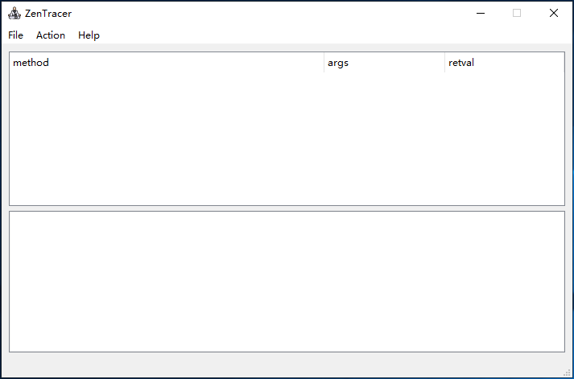

  

### screenshot

### problem
	1. the commandline trace script is not intuitive, so i use the PyQt draw UI.
	2. * maybe has some bug, please fix when using..

### usage
	1. require `PyQt5` & `frida`.
	2. manage Match/Black Pattern of target in `Action`.
	3. support double match mode: 'M'(match),'E'(equal); such as: 'M:android.content.', 'E:android.content.ContextImpl'.
	4. `Import jadx-jobf` can modify classname to sync jadx deobfuscate.
	5. `Export\Import JSON` can save\restore call tree.

### changelog

#### 20211225
	1. repair some bugs. ex start & stop button
	2. fix usb and vm connect code, u can use this with usb connections or vm programs.
	3. some other fixes, if u find more, issue it, here.

#### 20190926
	1. [untested\imperfect] support multiprocess.
	2. merge ui code.
	3. fix bugs.
	4. add README :)

#### ....
